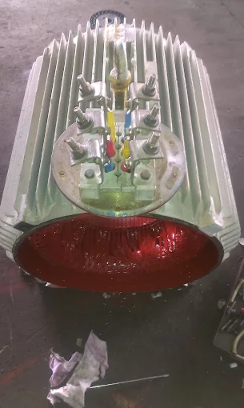
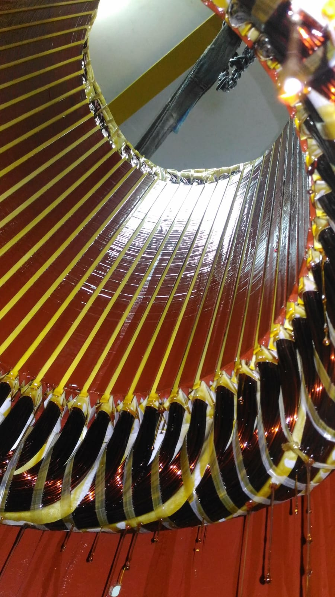

<html lang="en">
<head>
    <meta charset="UTF-8">
    <meta name="viewport" content="width=device-width, initial-scale=1.0">
    <title>Excel Electricals | Motor Winding & Repair Workshop</title>
    
    <!-- Google Fonts -->
    <link rel="preconnect" href="https://fonts.googleapis.com">
    <link rel="preconnect" href="https://fonts.gstatic.com" crossorigin>
    <link href="https://fonts.googleapis.com/css2?family=Plus+Jakarta+Sans:wght@500;600;700;800&family=Space+Grotesk:wght@700;800&display=swap" rel="stylesheet">
    
    <!-- FontAwesome Icons -->
    <link rel="stylesheet" href="https://cdnjs.cloudflare.com/ajax/libs/font-awesome/6.4.0/css/all.min.css">

    <!-- Analytics Tag -->
    
    

    
</head>
<body>

    <!-- HEADER NAVIGATION -->
    <header>
        <a href="#home" class="brand-logo">
            
<i class="fa-solid fa-bolt"></i>

            EXCEL ELECTRICALS
        </a>

        <!-- Hamburger Toggle Button for Mobile -->
        <button class="mobile-toggle" id="menuToggle" aria-label="Toggle Navigation">
            <i class="fa-solid fa-bars"></i>
        </button>

        <nav id="navMenu">
            <a href="#home">Home</a>
            <a href="#gallery">Gallery</a>
            <a href="#services">Services</a>
            <a href="#about">About</a>
            <a href="#contacts">Contacts</a>
            <a href="#request" class="nav-btn">Service Request</a>
        </nav>
    </header>

    <!-- HOME HERO SECTION -->
    <section class="hero" id="home">
        

            

                <i class="fa-solid fa-shield-halved"></i> Certified Motor Workshop • Choondy, Aluva
            

            <h1>EXPERT ELECTRIC MOTOR WINDING & REPAIR</h1>
            
Reliable stator rewinding, coil varnishing, dynamic rotor testing, and complete motor repairs with guaranteed super-enameled copper wire.

            

                <a href="tel:+918590259451" class="btn btn-primary"><i class="fa-solid fa-phone"></i> Call Workshop</a>
                <a href="https://wa.me/918590259451" class="btn btn-outline" target="_blank"><i class="fa-brands fa-whatsapp" style="color: #FFD700;"></i> WhatsApp Chat</a>
                <a href="mailto:excelelectricalswork@gmail.com" class="btn btn-email"><i class="fa-solid fa-envelope" style="color: #FFD700;"></i> Email Us</a>
            

        

        

            
        

    </section>

    <!-- GALLERY SECTION -->
    <section id="gallery">
        

            <small>Workmanship</small>
            <h2>Motor Repair Gallery</h2>
        

        

            

                

                    
                

                

                    <h3>Induction Motor Repair</h3>
                    
Heavy duty single & 3-phase induction motor diagnostic, overhaul, and testing.

                

            

            

                

                    
                

                

                    <h3>Stator Copper Winding</h3>
                    
High-grade dual coated copper wire coil insertion, slot insulation paper, and lacing setup.

                

            

            

                

                    
                

                

                    <h3>Coil Insulation & Varnishing</h3>
                    
Deep insulating varnish application and controlled oven baking to protect against moisture and short circuits.

                

            

            

                

                    
                

                

                    <h3>Pump Servicing</h3>
                    
Submersible, openwell, and centrifugal pump motor rewinding, mechanical seal replacement, and leak testing.

                

            

        

    </section>

    <!-- SERVICES SECTION -->
    <section id="services">
        

            <small>High Quality</small>
            <h2>Our Workshop Services</h2>
        

        

            
            <!-- CARD 1 -->
            

                

                    
                

                

                    

                        
<i class="fa-solid fa-bolt"></i>

                        <h3 style="margin: 0;">Stator Rewinding</h3>
                    

                    
Complete single-phase and 3-phase electric motor coil rewinding with 100% super-enameled copper wire.

                

            

            <!-- CARD 2 -->
            

                

                    
                

                

                    

                        
<i class="fa-solid fa-fill-drip"></i>

                        <h3 style="margin: 0;">Coil Varnishing & Baking</h3>
                    

                    
High-dielectric insulating varnish dipping and oven baking for maximum vibration protection and moisture resistance.

                

            

            <!-- CARD 3 -->
            

                

                    
                

                

                    

                        
<i class="fa-solid fa-screwdriver-wrench"></i>

                        <h3 style="margin: 0;">Excetor Rotor Rewinding</h3>
                    

                    
 Complete 3-phase alternator exciter rotor rewinding, double-coated enamel copper wire replacement, rotating diode bridge testing, Class H insulation, and Megger testing.

                

            

            <!-- CARD 4 -->
            

                

                    
                

                

                    

                        
<i class="fa-solid fa-gear"></i>

                        <h3 style="margin: 0;">Bearing & Mechanical Overhaul</h3>
                    

                    
Precision SKF/NBC bearing replacement, shaft polishing, housing alignment, and mechanical noise reduction.

                

            

        

    </section>

    <!-- ABOUT SECTION -->
    <section id="about">
        

            <small>Who We Are</small>
            <h2>About Excel Electricals</h2>
        

        

            

                <h3 style="font-size: 1.8rem; margin-bottom: 15px;">Dedicated Motor Winding Specialist</h3>
                
Excel Electricals provides fast, trusted, and durable motor winding solutions for industrial machines, domestic pumps, and commercial equipment in Choondy, Aluva.

                <ul class="about-features">
                    <li><i class="fa-solid fa-circle-check"></i> 100% Super Enameled Copper Wire</li>
                    <li><i class="fa-solid fa-circle-check"></i> High-Grade Dielectric Varnishing & Baking</li>
                    <li><i class="fa-solid fa-circle-check"></i> Fast Turnaround & Full Testing Guarantee</li>
                </ul>
            

            

                
            

        

    </section>

    <!-- CONTACTS SECTION -->
    <section id="contacts">
        

            <small>Reach Us</small>
            <h2>Contact & Location</h2>
        

        

            

                

                    
<i class="fa-solid fa-location-dot"></i>

                    

                        <h4 style="margin: 0 0 4px 0; font-size: 1.1rem;">Workshop Location</h4>
                        
Choondy, Edathala, Aluva, Ernakulam, Kerala

                    

                

                

                    
<i class="fa-solid fa-phone"></i>

                    

                        <h4 style="margin: 0 0 4px 0; font-size: 1.1rem;">Phone & WhatsApp</h4>
                        
+91 85902 59451

                    

                

                

                    
<i class="fa-solid fa-envelope"></i>

                    

                        <h4 style="margin: 0 0 4px 0; font-size: 1.1rem;">Email Address</h4>
                        
excelelectricalswork@gmail.com

                    

                

                

                    
<i class="fa-solid fa-id-card"></i>

                    

                        <h4 style="margin: 0 0 4px 0; font-size: 1.1rem;">GST Registration</h4>
                        
GSTIN: 32AAGPX3837Q1ZZ

                    

                

            

            

                <iframe src="https://maps.google.com/maps?q=Excel%20Electricals,%20Choondy,%20Aluva&t=&z=15&ie=UTF8&iwloc=&output=embed" width="100%" height="100%" style="border:0;" allowfullscreen="" loading="lazy"></iframe>
            

        

    </section>

  <!-- SERVICE REQUEST FORM SECTION -->
<section id="request">
    

        <small>Online Booking</small>
        <h2>Submit a Service Request</h2>
    

    

        

            <form id="directMsgForm">
                <!-- Web3Forms Access Key -->
                <input type="hidden" name="access_key" value="823e3a3d-8f8f-474a-ba21-2c91b05bee2a">

                <!-- Botcheck Honeypot to block spam -->
                <input type="checkbox" name="botcheck" style="display: none;">

                

                    <label>Your Name</label>
                    <input type="text" name="name" id="custName" class="form-control" placeholder="Enter full name" required>
                

                

                    <label>Phone Number</label>
                    <input type="tel" name="phone" class="form-control" placeholder="Enter 10-digit mobile number" required>
                

                

                    <label>Motor Issue / Equipment Details</label>
                    <textarea name="message" rows="4" class="form-control" placeholder="Describe HP, motor brand, or motor fault..." required></textarea>
                

                <button type="submit" id="submitBtn" class="btn btn-primary" style="width: 100%; justify-content: center;">
                    <i class="fa-solid fa-paper-plane"></i> Send Request
                </button>

                

            </form>
        

    

</section>

    <!-- FLOATING QUICK BAR -->
    

        <a href="tel:+918590259451" class="float-link float-gold"><i class="fa-solid fa-phone"></i> Call Workshop</a>
        |
        <a href="https://wa.me/918590259451" class="float-link" target="_blank"><i class="fa-brands fa-whatsapp" style="color: #22c55e;"></i> WhatsApp</a>
        |
        <a href="mailto:excelelectricalswork@gmail.com" class="float-link float-blue"><i class="fa-solid fa-envelope"></i> Email Us</a>
    

    <!-- LIGHTBOX MODAL POPUP -->
    

        &times;
        
    

    <!-- FOOTER -->
    <footer>
        

            4.9 Rating
            ★★★★★
            Google Verified
        

        
&copy; 2020–2026 Excel Electricals. All Rights Reserved | Choondy, Aluva, Ernakulam, Kerala | GSTIN: 32AAGPX3837Q1ZZ

    </footer>

    <!-- JavaScript -->
    
</body>
</html>
